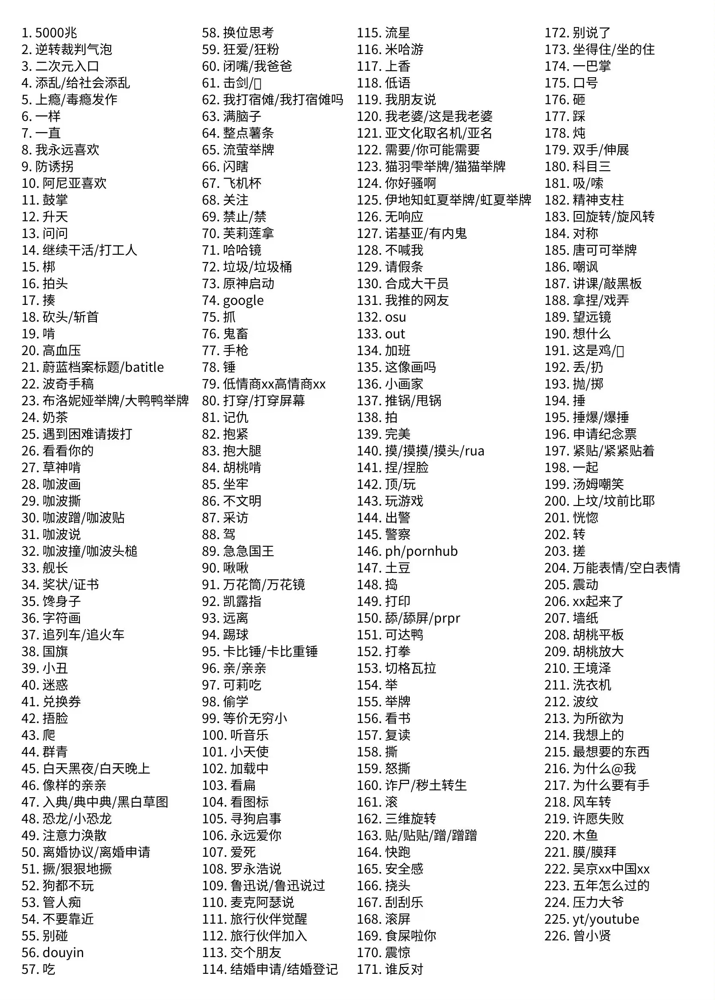
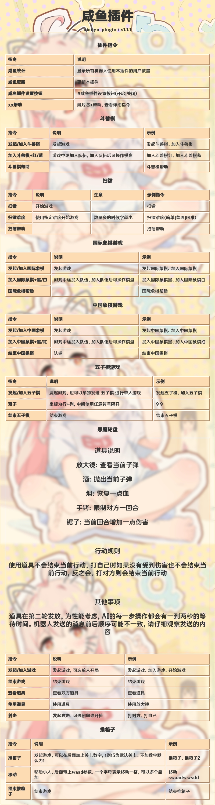

# 基础指令

##  基础篇

### 1. 打卡
发送`#打卡`的指令，即可查看你有多幸运。

```
橙子BOT：@xxx  打卡成功！
        你今天抽到的幸运值为14点
```
> ##### 附加功能：可点击`今日欧皇`的按钮，即可查看今日欧皇是谁。

### 2. 今日人品
发送`#今日人品`的指令，即可查看你今日的人品数值为多少。

```
橙子BOT：今日人品(据说人品好，一整天都会幸运)  
        你今日的人品是：xx，xxx！
```

### 3. 今日运势
发送`#今日运势`的指令，即可查看今天的运势情况。

```
橙子BOT：【例】@xxx
        今日运势
        我没有迷信！我就是想看看~
        运势：凶
        星级：★☆☆☆☆☆☆
        点评：利不及费，坐食山空，如无智谋，难望成功
        解读：入不敷出，即使有很好的基础，如果没有智谋或用人不善，难以发扬光大，最终可能败掉一切。
```

### 4. 答案之书
发送`#答案之书`的指令，心中默想一个问题或在发送指令前在聊天框发送一条指令，即可查看`#答案之书`给你的答案。

```
橙子BOT：【例】没法保证。
             THERE'S NO GUARANTEE.
```

### 5. 疯狂星期四
发送`#疯狂星期四`的指令，即可获得一个套路别人给你点KFC的发疯文案。

```
橙子BOT：我想问一下大家，之前朋友找我借钱，
        前后加起来有大概七万（够立案），
        但是没有借条也没有字据，
        微信也早已互删没有任何关于借的字眼，
        只有支付宝上还有转账记录。
       派出所刚让我把转账记录发给他看一下的时候，
       我点支付宝点歪了，
       不小心点开了肯德基，
       发现今天是疯狂星期四，
       谁请我吃?
```

### 6. meme表情包
发送`meme表情包`的指令，即可随机获得一张meme表情包哦！



### 7. 喜加一
发送`喜加一`的指令，即可了解到EPIC游戏平台的一款**免费入库的游戏**。


### 8. 点歌
发送`#点歌`指令，即可获得机器人通过语音形式发送所点歌曲。
```
橙子BOT：[语音]
```

### 9. 咸鱼帮助
发送`#咸鱼帮助`指令，即可获得一个小游戏合集。



---
以上为基础篇里所包含的指令教程及效果展示，更多功能和实际效果请以个人使用情况为准！ 


